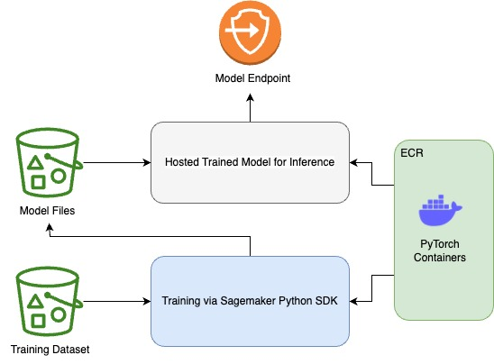

# AI or Human Generated Text Classification Using GPT2 on AWS Sagemaker

This repository contains a text classification model designed to detect AI-generated text. The OpenAI GPT-2 (GP2) model is utilized to build this classification model.

## Model
The model is trained on AWS Sagemaker. The prebuilt PyTorch container provided by AWS Sagemaker is used for training. The Sagemaker Python SDK is employed to create the training and deployment pipeline. After the training and evaluation phases, the trained model is saved to an S3 bucket. Finally, the trained model is hosted on ML computer instances, and a secure endpoint is created for inference.

The model architecture is presented below.

## Dataset
The model is trained using a dummy dataset consisting of 100 examples. However, it is recommended to replace this dummy dataset with an actual dataset that contains texts and corresponding labels. In the dataset, the label 1 represents AI-generated text, while the label 0 corresponds to human-generated text. By using a real dataset, the model can learn from more diverse and representative examples, leading to improved performance and accuracy in detecting AI-generated text.